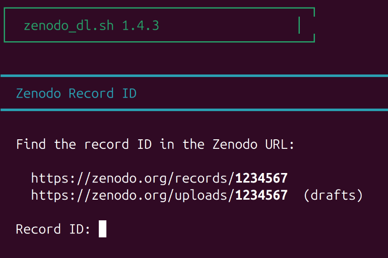

# zenodo_dl

Download files from Zenodo repositories (public, restricted, or draft).




## Features

| Feature | Description |
|---------|-------------|
| **One-liner** | Run directly via `bash <(curl ...)` — no install needed |
| **Interactive menu** | List, download, extract — all from one interface |
| **Encrypted tokens** | AES-256 encryption for stored credentials (default) |
| **Flexible download** | ZIP archive, individual files, or pattern matching |
| **Draft support** | Works with unpublished/restricted Zenodo records |
| **No dependencies** | Just `curl`, `jq`, `openssl` (pre-installed on most systems) |

## Quick Start

**Run directly (no install):**

```bash
bash <(curl -fsSL https://raw.githubusercontent.com/mbz4/zenodo_dl/main/zenodo_dl.sh)
```

**Or download and run:**

```bash
curl -LO https://raw.githubusercontent.com/mbz4/zenodo_dl/main/zenodo_dl.sh
chmod +x zenodo_dl.sh
./zenodo_dl.sh
```

## Usage

```bash
./zenodo_dl.sh              # interactive — prompts for record ID
./zenodo_dl.sh 12345678     # with record ID
./zenodo_dl.sh --help       # help
./zenodo_dl.sh --uninstall  # remove stored token
```

With pre-set token (CI/scripts):

```bash
ZENODO_TOKEN="your_token" ./zenodo_dl.sh 12345678 # Zenodo record ID
```

## Token

For restricted or draft records, you need a Personal Access Token:

1. https://zenodo.org/account/settings/applications/
2. **+ New token** → name it → check **deposit:read** → Create
3. Copy immediately (shown only once)

The script looks for tokens in order:
1. `$ZENODO_TOKEN` environment variable
2. `~/.zenodo_token.enc` (encrypted, passphrase required)
3. `~/.zenodo_token` (plaintext, chmod 600)
4. Interactive prompt

### Encrypted storage (default)

When saving a token, you'll be prompted to choose:

```
Save token?
  1) Encrypted (passphrase each use) ← recommended
  2) Plaintext (chmod 600)
  3) Don't save
```

Encrypted tokens use AES-256-CBC with PBKDF2 key derivation via openssl.

### Storing your passphrase

The passphrase protects your Zenodo token at rest. Options for remembering it:

| Method | Pros | Cons |
|--------|------|------|
| **Password manager** (1Password, Bitwarden, Dashlane, KeePassXC) | Most secure, syncs across devices | Requires setup |
| **Memorable phrase** | Nothing to install | Must be unique, not reused |
| **Written down** (secure location) | Simple, offline | Physical security required |

If passphrase management feels like overkill for your use case, the plaintext option (chmod 600) is still reasonable — it protects against casual access and remote attacks, just not against someone with root access to your machine.

## Requirements

- `curl`
- `jq`
- `openssl` (for token encryption)

```bash
# Debian/Ubuntu
sudo apt install curl jq openssl

# macOS (usually pre-installed)
brew install curl jq openssl
```

## Cleanup

```bash
./zenodo_dl.sh --uninstall  # removes ~/.zenodo_token and ~/.zenodo_token.enc
rm zenodo_dl.sh             # delete the script
```

### Optional: Add to PATH

To run `zenodo_dl` from anywhere, go to your install dir and:
```bash
ln -s "$(pwd)/zenodo_dl.sh" ~/.local/bin/zenodo_dl
```

If `~/.local/bin` isn't in your PATH, add to `~/.bashrc`:
```bash
export PATH="$HOME/.local/bin:$PATH"
```

To remove: `rm ~/.local/bin/zenodo_dl`

## License

Apache 2.0